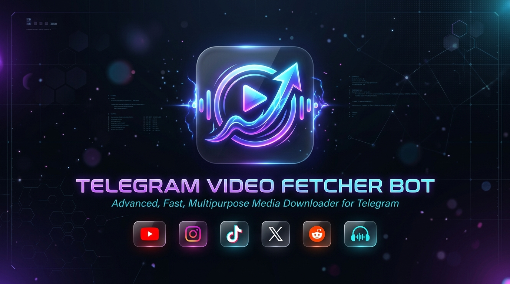

<p align="center">
  
</p>

# 🚀 Telegram Video Fetcher Bot

<p align="center">
  <a href="README.md">🇷🇺 Русский</a> | <b>🇬🇧 English</b>
</p>

<p align="center">
  
  
  
  
  
</p>

---

> ⚡ **The ultimate, ultra-fast media downloader for Telegram!**  
> Grab high-definition video in **1080p / 720p / 480p**, extract crisp **MP3 audio**, and download content seamlessly from **YouTube, Shorts, TikTok, Instagram, Twitter (X), Reddit, Pinterest, and VK** with a single tap!

---

## 🔥 Key Highlights

* 🎬 **Instant Quality Selection:** Choose between **1080p FHD**, **720p HD**, or lightweight **480p**. If a file exceeds size thresholds, the bot automatically falls back to the next best resolution without failing!
* 🎵 **One-Tap MP3 Audio Extraction:** Want only the soundtrack, music track, or podcast? Tap `🎵 Аудио (MP3)` — the bot extracts the pristine audio stream, tags it with ID3 metadata (artist, title, album cover), and sends it to the native Telegram player.
* ⚡ **Quick Mode (`/mode`):** Skip confirmation buttons entirely! When Quick Mode is enabled, short videos (Shorts, Reels, TikTok <= 5 minutes) download and arrive in your chat instantly upon sending the link.
* ⏳ **Real-Time Progress Bar:** Never wonder if the bot froze. Enjoy live progress updates with percentage, download speed, and estimated time remaining:
  ```text
  ⏳ Скачивание...
  ▰▰▰▰▰▱▱▱▱▱ 50.0%
  💾 45.2 MB / 90.4 MB
  ⚡ 5.4 MB/s • Осталось: 00:08
  ```
* 🚀 **Giant Files up to 2000 MB:** Say goodbye to Telegram's default 50 MB cloud limit. Bundled with a self-hosted **Local Telegram Bot API Server**, enabling file deliveries up to **2 GB** with zero double-hop network latency.
* 🧼 **Clean TikTok Downloads:** Videos are delivered without watermarks or intrusive branding overlays.
* 📸 **Carousels & Multi-Item Albums:** Multi-photo and multi-video Instagram posts and TikTok slideshows are automatically bundled and delivered as native Telegram `MediaGroup` albums (up to 10 items).
* 🛡️ **YouTube 403-Immune Engine:** Emulates modern mobile clients (`android`, `ios`, `mweb`) with automatic retry routines, completely neutralizing Google's anti-bot SABR blocks.

---

## 🌐 Supported Platforms

| Platform | Capabilities | Highlights |
| :--- | :--- | :--- |
| **YouTube** | Standard Videos, Shorts | 1080p, 720p, 480p, MP3, 403-bypass |
| **Instagram** | Reels, Posts, Carousels, Stories | Multi-item albums, direct Story fetch |
| **TikTok** | Video Clips & Slides | Clean, watermark-free delivery |
| **Twitter / X** | Videos & GIFs | Native format preservation |
| **Reddit** | Subreddit Videos | Audio + Video muxing |
| **Pinterest** | Video Pins | High quality original video |
| **VK** | VK Video, Clips | Direct streaming capture |
| **Universal Web** | Vimeo, Rutube, and 1000+ others | Smart yt-dlp fallback engine |

---

## 🛠️ Architecture Overview

```text
┌─────────────────┐       Long Polling        ┌────────────────────────┐
│  Telegram User  │ ◄──────────────────────► │     aiogram 3.7+       │
│  Client App     │                           │  (Python 3.12 runtime) │
└─────────────────┘                           └───────────┬────────────┘
                                                          │
                    ┌─────────────────────────────────────┴─────────────────────────────────────┐
                    ▼                                                                           ▼
      ┌───────────────────────────┐                                               ┌───────────────────────────┐
      │   Telegram Bot API        │                                               │   Download Engine         │
      │   (Local Server Container)│                                               │   (yt-dlp + ffmpeg)       │
      │   - Upload limit: 2000 MB │                                               │   - YT Mobile Clients     │
      │   - Zero-copy file URI    │                                               │   - ID3 MP3 Extractor     │
      └─────────────┬─────────────┘                                               │   - Real-time Progress    │
                    │                                                             └─────────────┬─────────────┘
                    └─────────────────────────────┬─────────────────────────────────────────────┘
                                                  ▼
                                      ┌───────────────────────┐
                                      │  Shared Storage /     │
                                      │  Docker Volume /data  │
                                      │  (TTL Auto-Purge)     │
                                      └───────────────────────┘
```

---

## 🚀 Quick Start

### 1. Clone the repository

```bash
git clone https://github.com/veshniakov/bot-fetcher.git
cd bot-fetcher
```

### 2. Configure Environment

Copy the example environment file:

```bash
cp .env.example .env
```

Edit `.env` and provide your credentials:

```env
# Bot token from @BotFather
BOT_TOKEN=1234567890:ABCdefGHIjklMNOpqrSTUvwxYZ

# API credentials from https://my.telegram.org (required for Local Bot API)
TELEGRAM_API_ID=1234567
TELEGRAM_API_HASH=0123456789abcdef0123456789abcdef

# Administrator Telegram ID (for /stats command)
ADMIN_USER_ID=123456789

# Local Telegram Bot API Server configuration (enables 2000 MB uploads)
TELEGRAM_API_BASE_URL=http://telegram-bot-api:8081
TELEGRAM_LOCAL_MODE=true
MAX_TELEGRAM_UPLOAD_MB=2000

# Optional proxy for restricted networks
PROXY_URL=
```

### 3. Launch via Docker Compose

```bash
docker compose up -d --build
```

Check container status and live logs:

```bash
docker compose ps
docker compose logs -f bot
```

---

## 🤖 Bot Commands

| Command | Description |
| :--- | :--- |
| `/start` | Launch the bot and view welcome menu |
| `/help` | Detailed guide on supported sources and features |
| `/mode` | ⚡ Toggle between **Normal** (preview card) and **Quick** mode |
| `/id` | Show your unique Telegram User ID |
| `/stats` | 📊 Real-time server and usage statistics (admin only) |

---

## 🔒 Security & Stability

- **Concurrency Control:** Hardened with `asyncio.Semaphore(10)` to prevent CPU/memory spikes during traffic surges.
- **Anti-Spam Task Guards:** Enforces one active processing task per user at a time.
- **SSRF / Local Network Protection:** Disallows downloads targeting internal/private subnets (`localhost`, `127.0.0.1`, `192.168.x.x`).
- **Automated Garbage Collection:** Background cleanup loop periodically sweeps task workspaces and stale files older than 30 minutes.

---

## 📄 License

Licensed under the **MIT License**. See [LICENSE](LICENSE) for details.
